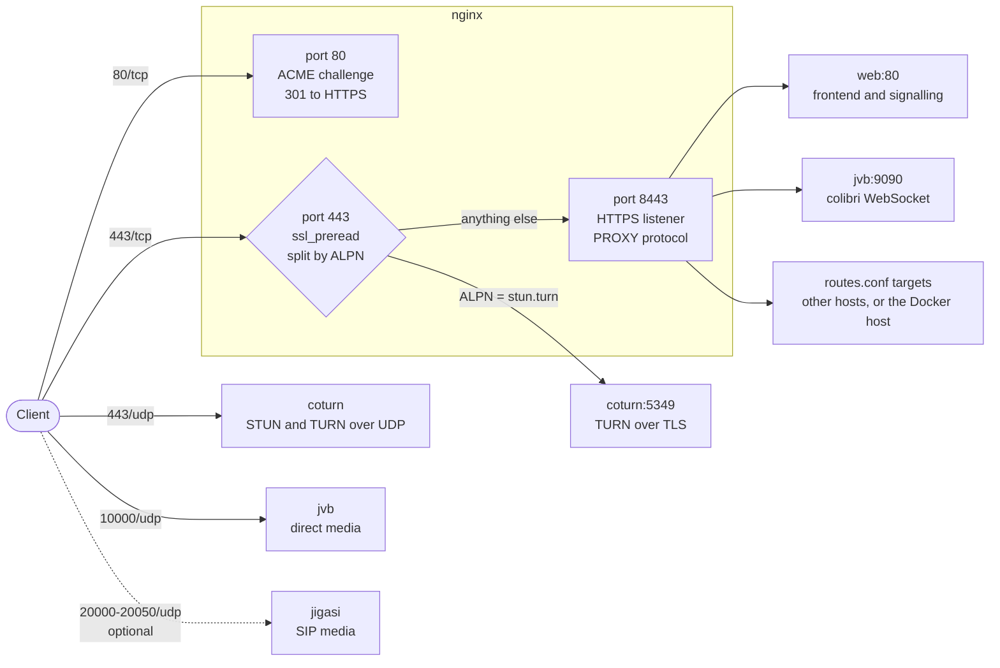
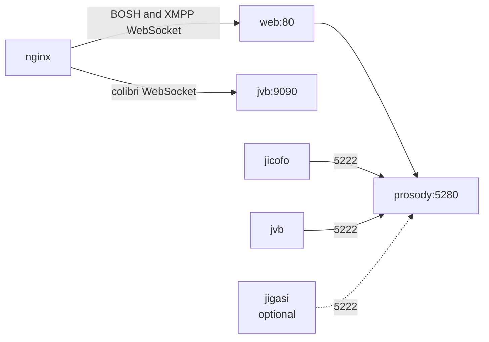
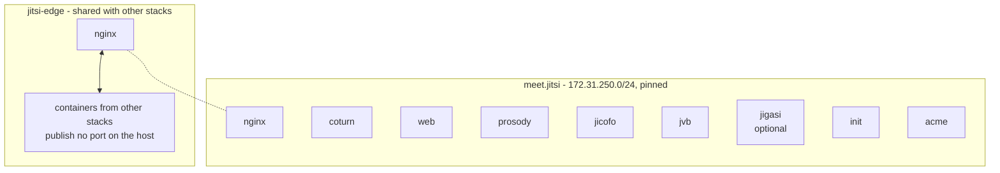

# Jitsi Meet stack

A single `docker-compose.yml` that deploys a complete Jitsi Meet server: the
web frontend, the XMPP server, the focus component, the video bridge, a TURN
server and the reverse proxy in front of them.

Nothing is hardcoded. One environment file states the Jitsi version, the
domains to serve, the Prosody plugins to install and how certificates are
obtained. There is no build step and no registry, so the stack deploys from a
Git repository in Portainer as it is.

## What it does that a stock Jitsi deployment does not

- **Serves several domains** from one instance, each with its own set of
  sub-paths proxied elsewhere.
- **Shares port 443 between HTTPS and TURN**, so clients behind a firewall that
  only allows 443 can still join.
- **Installs Prosody plugins** from a list of URLs, keeping the last working
  copy when a download fails.
- **Issues certificates** with Let's Encrypt over HTTP-01 or DNS-01 against
  Azure DNS, or uses one you supply.
- **Survives Jitsi upgrades**: no generated configuration is frozen and no
  variable names are enumerated, so a new release needs no changes here.

## Quick start

```sh
cp .env.example .env
$EDITOR .env                 # version, domains, JWT, TURN_HOST
./scripts/gen-secrets.sh     # fills the empty secrets

cp conf/routes.conf.example conf/routes.conf
$EDITOR conf/routes.conf     # sub-paths proxied elsewhere, per domain

cp /path/to/fullchain.pem conf/certs/
cp /path/to/privkey.pem   conf/certs/

docker compose up -d
```

To have the stack issue the certificate instead, set `TLS_MODE=acme-http` (or
`acme-dns-azure` for wildcards) and `ACME_EMAIL`, and skip the two `cp` lines.

## Layout

```
docker-compose.yml
.env.example              every setting, documented inline
scripts/gen-secrets.sh    fills the empty secrets in .env
conf/
  routes.conf             sub-paths proxied elsewhere, per domain
  certs/                  certificates, private keys, extra CA
  branding/               logo, background, dynamic branding JSON
  nginx/
    nginx.conf            static: the 443 split and the include layout
    snippets/             included by site files
    sites/                vhosts that are not part of this deployment
  prosody/
    plugins/              downloaded on startup
    plugin-conf/          templates for plugin configuration
  coturn/                 TURN server template
  scripts/                startup scripts
docs/
  design.md               architecture and the decisions behind it
  deployment.md           installation, operation and upgrade manual
```

`conf/` holds the live configuration and is not versioned beyond the templates
and `.example` files.

## Topology

### What arrives from outside



Only four ports need to be open inbound. The TURN relay range
(`TURN_RELAY_MIN_PORT`..`TURN_RELAY_MAX_PORT`) does **not**: those ports face
the video bridge inside the stack, never the client.

| Port | Protocol | Container | Carries |
|---|---|---|---|
| 80 | TCP | nginx | ACME challenges; everything else redirects to HTTPS |
| 443 | TCP | nginx | HTTPS *and* TURN over TLS, separated by ALPN |
| 443 | UDP | coturn | STUN, and TURN over UDP |
| 10000 | UDP | jvb | Direct media, used whenever the client's network allows it |
| 20000-20050 | UDP | jigasi | SIP media. Only when the `jigasi` profile is on |

For a version you can hand to a client's IT department, see
[docs/network-requirements.svg](docs/network-requirements.svg).

### What happens inside



nginx never talks to Prosody directly: signalling goes through the web
container, which is what upstream expects.

### Networks



nginx is the only service on both networks, so it appears twice above.

| Network | Members | Why |
|---|---|---|
| `meet.jitsi` | every service | The stack's own private network. Its subnet is pinned because coturn's peer allow-list has to name it exactly |
| `jitsi-edge` | `nginx`, plus containers from other stacks | Lets nginx proxy to other stacks without any of them publishing a port on the host. Created by this stack; the others join it as external |

### Services

| Service | Role | Runs |
|---|---|---|
| `init` | Renders the generated files, then exits | once, before the rest |
| `nginx` | Reverse proxy, TLS termination, 443 splitter | always |
| `coturn` | STUN and TURN | always |
| `web` | Jitsi Meet frontend | always |
| `prosody` | XMPP server; hosts the plugins | always |
| `jicofo` | Conference focus: decides | always |
| `jvb` | Video bridge: transports | always |
| `jigasi` | SIP gateway and transcription | `COMPOSE_PROFILES=jigasi` |
| `acme` | Certificate issuance and renewal | only when `TLS_MODE=acme-*` |

## Documentation

- [Design](docs/design.md) -- how the pieces fit together and why.
- [Deployment manual](docs/deployment.md) -- installing, operating, upgrading
  and troubleshooting.
